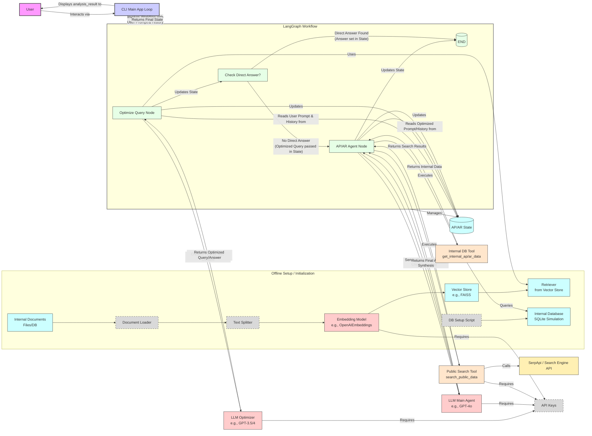

```mermaid
graph LR
    %% Define Styles
    classDef user fill:#f9f,stroke:#333,stroke-width:2px;
    classDef app fill:#ccf,stroke:#333,stroke-width:2px;
    classDef langgraph fill:#lightgrey,stroke:#666,stroke-width:2px;
    classDef node fill:#e6ffe6,stroke:#333,stroke-width:1px;
    classDef tool fill:#ffe6cc,stroke:#333,stroke-width:1px;
    classDef data fill:#ccffff,stroke:#333,stroke-width:1px;
    classDef service fill:#fff0b3,stroke:#333,stroke-width:1px;
    classDef llm fill:#ffcccc,stroke:#333,stroke-width:1px;
    classDef offline fill:#d9d9d9,stroke:#333,stroke-width:1px,stroke-dasharray: 5 5;

    %% Components
    U[User]:::user
    CLI[CLI Main App Loop]:::app
    LG[LangGraph Workflow Engine]:::langgraph
    STATE[(AP/AR State)]:::data

    subgraph LG [LangGraph Workflow]
        direction TB
        OptQ[Optimize Query Node]:::node
        Check[Check Direct Answer?]:::node
        AgentN[AP/AR Agent Node]:::node
        OptQ -- Updates State --> Check
        Check -- No Direct Answer<br>(Optimized Query passed in State) --> AgentN
        AgentN -- Updates State --> END_LG[(END)]
        Check -- Direct Answer Found<br>(Answer set in State) --> END_LG
    end

    subgraph OfflineSetup [Offline Setup / Initialization]
       direction TB
       Docs[Internal Documents<br>Files/DB]:::data
       DBSetup[DB Setup Script]:::offline
       Loader[Document Loader]:::offline
       Splitter[Text Splitter]:::offline
       Embed[Embedding Model<br> e.g., OpenAIEmbeddings]:::llm
       VS[Vector Store<br> e.g., FAISS]:::data
       Retriever[Retriever<br> from Vector Store]:::data

       DBSetup --> SQLiteDB
       Docs --> Loader --> Splitter --> Embed --> VS --> Retriever
    end


    LLM_Opt[LLM Optimizer<br> e.g., GPT-3.5/4]:::llm
    LLM_Agent[LLM Main Agent<br> e.g., GPT-4o]:::llm
    DBTool[Internal DB Tool<br> get_internal_ap/ar_data]:::tool
    SearchTool[Public Search Tool<br> search_public_data]:::tool
    SQLiteDB[Internal Database<br> SQLite Simulation]:::data
    SerpAPI[SerpApi / Search Engine API]:::service
    Env[.env / API Key Mgmt]:::offline

    %% Connections (Runtime Flow)
    U -- Interacts via --> CLI
    CLI -- Invokes Workflow with<br>User Prompt & History --> LG
    LG -- Manages --> STATE
    OptQ -- Reads User Prompt & History from --> STATE
    OptQ -- Uses --> Retriever
    OptQ -- Creates Prompt with Context --> LLM_Opt
    LLM_Opt -- Returns Optimized Query/Answer --> OptQ
    OptQ -- Updates --> STATE

    AgentN -- Reads Optimized Prompt/History from --> STATE
    AgentN -- Creates Prompt --> LLM_Agent
    LLM_Agent -- Decides Tool(s) --> AgentN
    AgentN -- Executes --> DBTool
    AgentN -- Executes --> SearchTool
    DBTool -- Queries --> SQLiteDB
    SearchTool -- Calls --> SerpAPI
    DBTool -- Returns Internal Data --> AgentN
    SearchTool -- Returns Search Results --> AgentN
    AgentN -- Sends Results to LLM for Synthesis --> LLM_Agent
    LLM_Agent -- Returns Final Answer --> AgentN
    AgentN -- Updates --> STATE

    LG -- Returns Final State --> CLI
    CLI -- Displays analysis_result to --> U

    %% Connections (Setup & Dependencies)
    Embed -- Requires --> Env[API Keys]
    LLM_Opt -- Requires --> Env
    LLM_Agent -- Requires --> Env
    SearchTool -- Requires --> Env
```