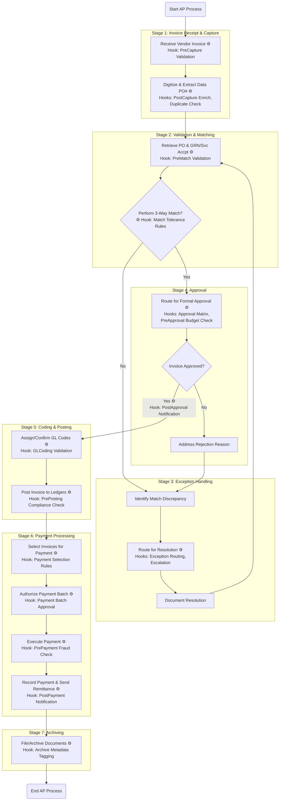

```graphql
llm_ap_ar_agent/
├── agents/
│   ├── llm_ap_ar_agent.py            # Main agent orchestration
│   ├── openai_function_handler.py    # OpenAI function schemas & tool handlers
├── chains/
│   ├── ap_chain.py                   # Chain logic for Accounts Payable
│   ├── ar_chain.py                   # Chain logic for Accounts Receivable
├── retrievers/
│   ├── query_optimizer.py            # Token-aware document retrieval + scoring
├── vectorstore/
│   ├── faiss_store.py                # FAISS-based vectorstore setup
├── public_data/
│   ├── vendor_scraper.py             # (Optional) Simulated vendor data scraping
├── main.py                           # CLI entry point (with args)
├── tests/
│   ├── test_llm_ap_ar_agent.py       # Unit tests for agent logic
│   ├── test_query_optimizer.py       # Tests for token/document filtering
├── requirements.txt
├── README.md
```
```bash
pip install -r requirements.txt
```
requirements.txt (sample):

```nginx
langchain
openai
faiss-cpu
tiktoken
unstructured
beautifulsoup4
chromadb  # Optional if switching to Chroma
```

How to Run

```bash
python main.py \
  --query "List all invoices due in April" \
  --mode ap \
  --vectorstore faiss
```

```
Modes supported:

ap – Accounts Payable

ar – Accounts Receivable

vendor – Vendor-specific

public – Scraped or public financial data
```

```txt
Key Features

✅ OpenAI function calling
✅ Context optimization with token limits
✅ LangChain-based tool agent
✅ Vectorstore retrieval (FAISS or Chroma)
✅ Testable with unittest and mocks
```

```bash
python -m unittest discover tests
```

```txt
requirements.txt

pip install -r requirements.txt --force-reinstall

# Core LLM Agent Stack
langchain==0.0.331
openai<1.0.0           # Required for compatibility with older LangChain
tiktoken

# Embeddings + Vector DB
faiss-cpu              # Or faiss-gpu if you prefer
chromadb

# Public Data and Utilities
google-search-results  # For SerpAPI (GoogleSearch)
python-dotenv
requests
beautifulsoup4

# Web UI
streamlit
pydantic<2.0           # Avoid Pydantic v2 unless LangChain fully supports it

# Optional for extended features or future LLM routers
sentence-transformers

```



```text
Fine Tuning

Fine-Tuning Roadmap for AP/AR Tasks
✅ 1. Define Task Scope & Output Format
Start by locking down the use cases you want the fine-tuned model to improve. Examples:

Use Case	Input	Desired Output
Invoice mapping	OCR text / docx / PDF	Structured JSON with fields
PO matching	Invoice + PO JSON	Match confidence, discrepancies
Rule compliance	Invoice/PO + business rules	Pass/fail, violated rules

👉 Define output schema in JSON (Pydantic model can help standardize this).

📦 2. Prepare Training Dataset
You’ll need 100s to 1000s of high-quality annotated examples.

🔹 a. Input Types
Extracted invoice/PO/business rule text

Associated metadata (vendor, amounts, dates)

🔹 b. Target Labels
Mapped JSON fields (invoice_id, line_items, tax, etc.)

Business rule results (approval thresholds, payment terms)

PO validation results (match/mismatch flags)

🔹 c. Format for Fine-Tuning
For OpenAI:

json
Copy
Edit
{"messages": [
  {"role": "system", "content": "You are an AP assistant that extracts structured fields from invoice and PO documents."},
  {"role": "user", "content": "Invoice text:\nVendor: Acme Corp\nAmount: $1,000\nDate: Jan 2, 2024\n..."},
  {"role": "assistant", "content": "{\n  \"vendor\": \"Acme Corp\",\n  \"amount\": 1000,\n  \"date\": \"2024-01-02\"\n}"}
]}
🛠️ 3. Fine-Tuning Pipeline Options
🔹 a. OpenAI Fine-Tuning
Ideal for GPT-3.5, less suitable for GPT-4 (not fine-tunable as of now)

Upload JSONL with messages, train via CLI or API

🔹 b. Open-source with LoRA
Use a small model like Mistral-7B, Phi, LLaMA

Train with LoRA (efficient parameter tuning)

Frameworks: HuggingFace + PEFT, QLoRA, Axolotl

🔹 c. Evaluation
Use held-out validation prompts

Compare fine-tuned vs base model on:

Field extraction accuracy

Rule validation correctness

Output structure conformity (e.g., JSON)

🧪 4. Deploy and Iterate
Inference Endpoint: Use FastAPI or LangChain agent with fallback to base model.

Monitor: Log errors like:

Field missing

Wrong format (e.g., dates, amounts)

Rule misinterpretation

Retrain periodically with edge cases.

🧰 Optional: Data Labeling Tools
Label Studio

Prodigy

Custom JSON label UI using Streamlit if needed

Would you like a sample training data file (OpenAI fine-tuning format) and a few synthetic labeled examples to get started?


You said:
Beautiful yes


ChatGPT said:
Here is your fine-tuning training dataset for AP (Accounts Payable) use cases:

📄 Download sample_finetune_ap_training_data.jsonl

It includes:

Structured invoice extraction

PO validation

Business rule checks

Would you also like a similar training file for AR (Accounts Receivable)? 
```

```text
That’s an excellent question — and very relevant in the context of Accounts Payable / Accounts Receivable (AP/AR) automation.

⚖️ Build vs Fine-Tune vs Use Foundation Models
✅ Recommended Approach: Fine-Tune or Prompt-Engineer Foundation Models
In the context of AP/AR tasks (like invoice verification, PO matching, business rule compliance), here's how the options compare:

🔹 1. Using Foundation Models (e.g., GPT-4, Claude, Gemini)
✅ Pros: No infra overhead, extremely capable out-of-the-box, supports complex reasoning, great zero-shot performance.

🚫 Cons: Can be expensive for high volume; may require prompt engineering or tools for structure.

Verdict: ✅ Best for rapid prototyping, low to medium volume use, or when flexibility is critical.

🔹 2. Fine-Tuning (e.g., OpenAI fine-tuning, LoRA on Mistral/BERT variants)
✅ Pros: Tailors model behavior, improves consistency for repeated structured tasks (like invoice labeling).

⚠️ Cons: Requires labeled data (~1000+ examples), infra for hosting (if not using OpenAI), and careful evaluation.

Verdict: ✅ Great for mid-size deployments if you need consistent formatting, label extraction, or custom compliance logic.

🔹 3. Training Your Own LLM from Scratch
🚫 Pros: Full control (architecture, data, tokenizer), potential cost savings at extreme scale.

🚫 Cons: Enormous resource demands (compute, data, time), hard to outperform GPT-4-level models for general reasoning.

Verdict: ❌ Not recommended for AP/AR unless you're a model lab or Fortune 100 company with R&D budget.

🔍 In Your Case (AP/AR Use Case):
Start with GPT-4 or Claude + strong prompt design + tools
Then optionally fine-tune on:

OCR-extracted invoice/PO pairs with annotations,

rule validation examples,

historical approval workflows.

🔧 Bonus: Useful Tools & Techniques
Pydantic or Marshmallow for schema validation of mapped data.

RAG (Retrieval-Augmented Generation) for contextual rule checking using business rules stored in vector DB.

LangChain/Guardrails to enforce output structure (JSON, tables).

LoRA-based fine-tuning on models like Mistral, LLaMA if self-hosting becomes viable.

That’s an excellent question — and very relevant in the context of Accounts Payable / Accounts Receivable (AP/AR) automation.

⚖️ Build vs Fine-Tune vs Use Foundation Models
✅ Recommended Approach: Fine-Tune or Prompt-Engineer Foundation Models
In the context of AP/AR tasks (like invoice verification, PO matching, business rule compliance), here's how the options compare:

🔹 1. Using Foundation Models (e.g., GPT-4, Claude, Gemini)
✅ Pros: No infra overhead, extremely capable out-of-the-box, supports complex reasoning, great zero-shot performance.

🚫 Cons: Can be expensive for high volume; may require prompt engineering or tools for structure.

Verdict: ✅ Best for rapid prototyping, low to medium volume use, or when flexibility is critical.

🔹 2. Fine-Tuning (e.g., OpenAI fine-tuning, LoRA on Mistral/BERT variants)
✅ Pros: Tailors model behavior, improves consistency for repeated structured tasks (like invoice labeling).

⚠️ Cons: Requires labeled data (~1000+ examples), infra for hosting (if not using OpenAI), and careful evaluation.

Verdict: ✅ Great for mid-size deployments if you need consistent formatting, label extraction, or custom compliance logic.

🔹 3. Training Your Own LLM from Scratch
🚫 Pros: Full control (architecture, data, tokenizer), potential cost savings at extreme scale.

🚫 Cons: Enormous resource demands (compute, data, time), hard to outperform GPT-4-level models for general reasoning.

Verdict: ❌ Not recommended for AP/AR unless you're a model lab or Fortune 100 company with R&D budget.

🔍 In Your Case (AP/AR Use Case):
Start with GPT-4 or Claude + strong prompt design + tools
Then optionally fine-tune on:

OCR-extracted invoice/PO pairs with annotations,

rule validation examples,

historical approval workflows.

🔧 Bonus: Useful Tools & Techniques
Pydantic or Marshmallow for schema validation of mapped data.

RAG (Retrieval-Augmented Generation) for contextual rule checking using business rules stored in vector DB.

LangChain/Guardrails to enforce output structure (JSON, tables).

LoRA-based fine-tuning on models like Mistral, LLaMA if self-hosting becomes viable.

Great — here’s a practical roadmap for fine-tuning an LLM for AP/AR use cases, especially focused on invoice, PO, and business rule extraction and validation.

🧭 Fine-Tuning Roadmap for AP/AR Tasks
✅ 1. Define Task Scope & Output Format
Start by locking down the use cases you want the fine-tuned model to improve. Examples:

Use Case	Input	Desired Output
Invoice mapping	OCR text / docx / PDF	Structured JSON with fields
PO matching	Invoice + PO JSON	Match confidence, discrepancies
Rule compliance	Invoice/PO + business rules	Pass/fail, violated rules

👉 Define output schema in JSON (Pydantic model can help standardize this).

📦 2. Prepare Training Dataset
You’ll need 100s to 1000s of high-quality annotated examples.

🔹 a. Input Types
Extracted invoice/PO/business rule text

Associated metadata (vendor, amounts, dates)

🔹 b. Target Labels
Mapped JSON fields (invoice_id, line_items, tax, etc.)

Business rule results (approval thresholds, payment terms)

PO validation results (match/mismatch flags)

🔹 c. Format for Fine-Tuning
For OpenAI:

json
Copy
Edit
{"messages": [
  {"role": "system", "content": "You are an AP assistant that extracts structured fields from invoice and PO documents."},
  {"role": "user", "content": "Invoice text:\nVendor: Acme Corp\nAmount: $1,000\nDate: Jan 2, 2024\n..."},
  {"role": "assistant", "content": "{\n  \"vendor\": \"Acme Corp\",\n  \"amount\": 1000,\n  \"date\": \"2024-01-02\"\n}"}
]}
🛠️ 3. Fine-Tuning Pipeline Options
🔹 a. OpenAI Fine-Tuning
Ideal for GPT-3.5, less suitable for GPT-4 (not fine-tunable as of now)

Upload JSONL with messages, train via CLI or API

🔹 b. Open-source with LoRA
Use a small model like Mistral-7B, Phi, LLaMA

Train with LoRA (efficient parameter tuning)

Frameworks: HuggingFace + PEFT, QLoRA, Axolotl

🔹 c. Evaluation
Use held-out validation prompts

Compare fine-tuned vs base model on:

Field extraction accuracy

Rule validation correctness

Output structure conformity (e.g., JSON)

🧪 4. Deploy and Iterate
Inference Endpoint: Use FastAPI or LangChain agent with fallback to base model.

Monitor: Log errors like:

Field missing

Wrong format (e.g., dates, amounts)

Rule misinterpretation

Retrain periodically with edge cases.

🧰 Optional: Data Labeling Tools
Label Studio

Prodigy

Custom JSON label UI using Streamlit if needed


