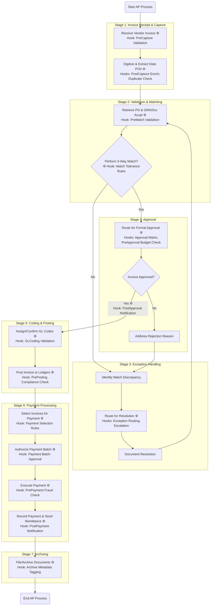

```graphql
llm_ap_ar_agent/
├── agents/
│   ├── llm_ap_ar_agent.py            # Main agent orchestration
│   ├── openai_function_handler.py    # OpenAI function schemas & tool handlers
├── chains/
│   ├── ap_chain.py                   # Chain logic for Accounts Payable
│   ├── ar_chain.py                   # Chain logic for Accounts Receivable
├── retrievers/
│   ├── query_optimizer.py            # Token-aware document retrieval + scoring
├── vectorstore/
│   ├── faiss_store.py                # FAISS-based vectorstore setup
├── public_data/
│   ├── vendor_scraper.py             # (Optional) Simulated vendor data scraping
├── main.py                           # CLI entry point (with args)
├── tests/
│   ├── test_llm_ap_ar_agent.py       # Unit tests for agent logic
│   ├── test_query_optimizer.py       # Tests for token/document filtering
├── requirements.txt
├── README.md
```
```bash
pip install -r requirements.txt
```
requirements.txt (sample):

```nginx
langchain
openai
faiss-cpu
tiktoken
unstructured
beautifulsoup4
chromadb  # Optional if switching to Chroma
```

How to Run

```bash
python main.py \
  --query "List all invoices due in April" \
  --mode ap \
  --vectorstore faiss
```

```
Modes supported:

ap – Accounts Payable

ar – Accounts Receivable

vendor – Vendor-specific

public – Scraped or public financial data
```

```txt
Key Features

✅ OpenAI function calling
✅ Context optimization with token limits
✅ LangChain-based tool agent
✅ Vectorstore retrieval (FAISS or Chroma)
✅ Testable with unittest and mocks
```

```bash
python -m unittest discover tests
```

```txt
requirements.txt

pip install -r requirements.txt --force-reinstall

# Core LLM Agent Stack
langchain==0.0.331
openai<1.0.0           # Required for compatibility with older LangChain
tiktoken

# Embeddings + Vector DB
faiss-cpu              # Or faiss-gpu if you prefer
chromadb

# Public Data and Utilities
google-search-results  # For SerpAPI (GoogleSearch)
python-dotenv
requests
beautifulsoup4

# Web UI
streamlit
pydantic<2.0           # Avoid Pydantic v2 unless LangChain fully supports it

# Optional for extended features or future LLM routers
sentence-transformers

```


