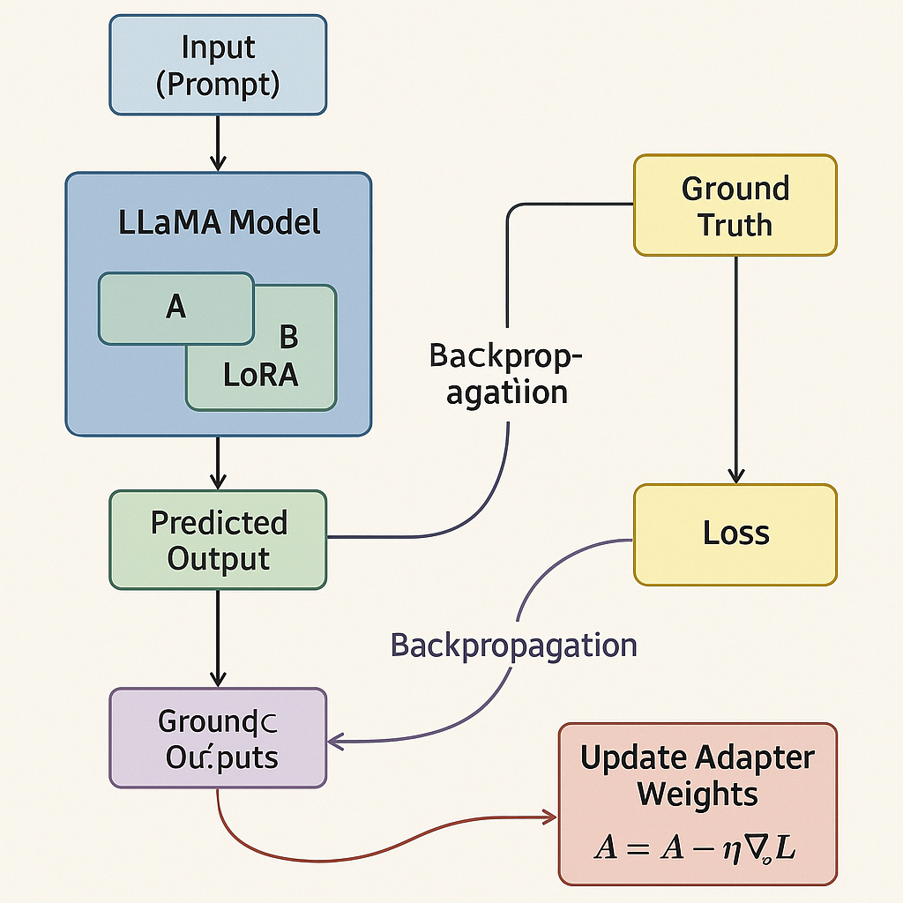
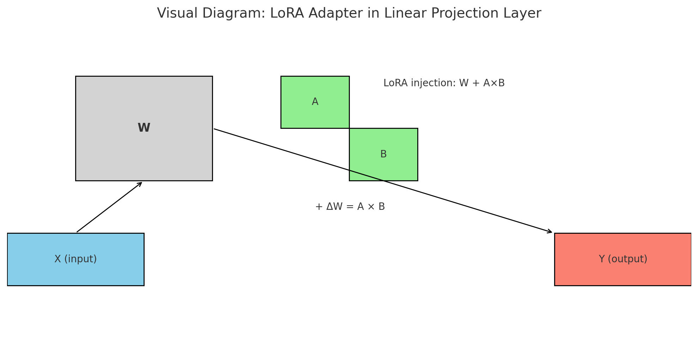

# 🧾 Fine-Tuned Invoice Toolchain using LoRA & Small Language Models

This project demonstrates how to fine-tune a Small Language Model (SLM) like TinyLLaMA or Mistral using LoRA (Low-Rank Adaptation) for executing an invoice processing toolchain: **validation**, **PO match**, **approval**, and **payment readiness** — all within a lightweight, efficient pipeline.

---

## 📦 Overview

- ✅ Fine-tune a base LLM using **Supervised Fine-Tuning (SFT)** and **LoRA (PEFT)**
- 🧠 Train the model to extract structured invoice fields and reason over toolchain steps
- 🚀 Merge adapter weights for standard inference
- 🌐 Run the model in a **Streamlit UI** with **PDF upload + toolchain output**

---

## 🎯 Goals

- Structured invoice field mapping from raw text
- Decision logic for:
  - `validate_invoice`
  - `match_po`
  - `run_approval`
  - `trigger_payment`
- Low-resource fine-tuning via **LoRA**
- Deployable inference from fine-tuned SLMs

---

## 🏗️ Fine-Tuning Approach

### ✅ Method: Supervised Fine-Tuning (SFT)
- Input: Prompt-style training with instruction + input text
- Output: JSON or status classification (VALID / APPROVED / REJECTED)
- Example Format (JSONL):
```json
{
  "instruction": "Extract invoice fields from the text.",
  "input": "Invoice #3421 from ACME Corp...",
  "output": {
    "invoice_id": "3421",
    "vendor": "ACME Corp",
    "invoice_date": "2023-04-01",
    "total_amount": "$4500"
  }
}
```

---

## 🧠 What is LoRA / PEFT?

### 🔧 LoRA (Low-Rank Adaptation)
LoRA adapts only a **low-rank subspace** of weight updates:

- Instead of training all model weights, it trains two small matrices `A` and `B`
- These are injected into projection layers like `q_proj`, `v_proj`
- Enables fine-tuning with **<1%** of original model size
- Result: 🚀 Fast training, low memory, high portability

### ✅ PEFT Benefits
| Feature         | Benefit                          |
|----------------|----------------------------------|
| 🔋 Efficient     | Train with 8–16 GB VRAM          |
| 💾 Small output | Adapter size is 5–100MB          |
| ♻️ Modular       | Plug & reuse adapters on demand  |
| ⚡ Fast          | Rapid experiments / deployment  |

---
### What happens during fine-tuning
✅ fine-tuning uses gradient descent—specifically, stochastic gradient descent (SGD) or its advanced variants (like AdamW) to update the model’s parameters (or adapter weights in LoRA/PEFT). Here's how it fits:

### 🔁 What happens during fine-tuning?
For each training example:

Input (Prompt) → passed through the model to get predicted output.

Compare predicted output with the ground truth (label) using a loss function (e.g., cross-entropy loss).

Backpropagation computes gradients of the loss w.r.t. trainable parameters.

Gradient descent step updates the weights to minimize the loss:

```textmate weight = weight - learning_rate * gradient```
🎯 In LoRA fine-tuning:
Instead of updating the full base model, we update only small adapter layers (e.g., LoRA matrices A and B) using gradient descent.
This massively reduces memory and compute but still uses the same optimization steps:
```textmate Forward pass → Loss → Backward (compute gradients) → Optimizer step (gradient descent)```

🧠 Optimizer used
Most LoRA fine-tuning setups use AdamW:

```python optimizer = AdamW(model.parameters(), lr=2e-4) ```
AdamW is a variant of stochastic gradient descent with weight decay, great for transformers.

#### ✅ Summary
| Aspect	              | Used in Fine-Tuning |
|----------------------| ------------        |
| Loss function	       |  ✅ (cross-entropy or similar) |
| Backpropagation      |	✅ |
| Gradient Descent     |	✅ |
| Adam/AdamW optimizer | ✅ |
| Full model update	   | ❌ (in PEFT, only adapters are updated) |




### Training Method Summary
| Component     | Value                                                                  |
|---------------|------------------------------------------------------------------------|
| Training Type | **Supervised fine-tuning (SFT)**                                       |
| Model Type    | **Causal Language Model (AutoModelForCausalLM)**                       |
| Objective     | **Next-token prediction** for instruction-based prompts                |
| Label Format  | Structured JSON / classification response / tool trigger string        |
| Loss Masking  | (Optional) Use `label_ids = -100` on prompt tokens to ignore loss      |
| Tuning Method | **LoRA (PEFT)**: lightweight fine-tuning (only a few adapters trained) |
| Batch Trainer | Hugging Face `Trainer`                                                 |

## 🧪 Training Script (LoRA + Transformers)

```python
from peft import get_peft_model, LoraConfig, TaskType
from transformers import AutoModelForCausalLM, AutoTokenizer

base_model = "TinyLlama/TinyLlama-1.1B-Chat-v1.0"

peft_config = LoraConfig(
    r=8,
    lora_alpha=16,
    target_modules=["q_proj", "v_proj"],
    lora_dropout=0.05,
    task_type=TaskType.CAUSAL_LM
)

model = AutoModelForCausalLM.from_pretrained(base_model)
model = get_peft_model(model, peft_config)
```

---

## 🔁 Merge Adapters for Inference

```python
from peft import PeftModel
from transformers import AutoModelForCausalLM

base_model = AutoModelForCausalLM.from_pretrained("TinyLlama/TinyLlama-1.1B-Chat-v1.0")
model = PeftModel.from_pretrained(base_model, "ft-invoice-model")
model = model.merge_and_unload()
model.save_pretrained("merged-invoice-model")
```

---

## 💡 Streamlit App (Toolchain Inference)

- Upload PDF or paste invoice text
- Run toolchain prompt through fine-tuned model
- View results: validation, approval, PO match, etc.

Run it:
```bash
streamlit run invoice_toolchain_slm_pdf_app.py
```

---

## 📄 Files

| File | Purpose |
|------|---------|
| `train.jsonl` | Labeled fine-tuning dataset |
| `merge_lora_to_base_model.py` | Merge LoRA adapter to base model |
| `invoice_toolchain_slm_app.py` | Streamlit UI for manual entry |
| `invoice_toolchain_slm_pdf_app.py` | Streamlit UI with PDF support |
| `ft-invoice-model/` | Fine-tuned LoRA adapter weights |
| `merged-invoice-model/` | Fully merged model for inference |

---

## On Fine Tuning
### Q1: What exactly happens during fine-tuning with SGD?
A:
When you fine-tune, you’re doing the same thing the original model did in training — just on a smaller, domain-specific dataset.
You run mini-batches of text (token IDs) through:

#### Forward pass:

- Inputs → Embeddings → Transformer layers → Logits (predicted token probabilities).

- For causal LMs like Mistral, each token predicts the next token.

#### Loss calculation:

- Compare predicted logits vs. the ground truth token IDs.

- Usually cross-entropy loss for language models.

#### Backward pass (backpropagation):

- Compute gradients for parameters w.r.t. loss.

- Gradients flow from output → back to input layer by layer.

- Uses chain rule and matrix calculus under the hood.

#### SGD update (often AdamW in practice):

- Adjust parameters slightly in the direction that reduces loss.

- Learning rate & weight decay control step size and regularization.

- 💡 In PEFT (see below), only some weights get gradients — others stay frozen.

### Q2: What is PEFT and why did we use it?
A:
#### PEFT = Parameter-Efficient Fine-Tuning.
- Instead of updating all billions of parameters, we update only a small subset — often <1% — and keep the rest frozen.

#### Advantages:

- Much less GPU VRAM needed.

- Much faster training.

- You can keep multiple small adapters for different tasks without retraining the whole model.

#### In our case:

- Extraction adapter → learns how to map invoice/SOW text to JSON fields.

- Toolchain adapter → learns how to execute invoice workflows (verification, PO matching, approval, payment).

### Q3: What is LoRA and how does it work in PEFT?
A:
#### LoRA = Low-Rank Adaptation — a common PEFT method.

Instead of training the full weight matrix $W∈R d×k$ in each attention/feed-forward layer:

- We freeze $W$ and insert a low-rank update: $W^t =W+BA$
- $A∈R^{r×k}$, $B∈R^{d×r}$ where r is small (LoRA rank).
- Only 𝐴 and 𝐵 are trained.
- At inference, LoRA weights are merged with 𝑊 on-the-fly.

#### Benefits:

- Trainable params reduced massively.

- Multiple LoRA adapters can be swapped in/out.

#### In our setup:

- One LoRA adapter trained for extraction.

- One LoRA adapter trained for toolchain reasoning.

### Q4: What are “tokens” and how do I configure them for fine-tuning?
A:
- A token is the smallest unit of text the model processes (words, subwords, punctuation).
- For Mistral-7B, the tokenizer uses SentencePiece/BPE subword encoding.

#### Config decisions:

- max_seq_length / max_length → controls max tokens per sample.

- batch_size → tokens × batch_size × gradient_accumulation_steps must fit in GPU RAM.

- max_new_tokens → affects inference length, not training length.

#### Training tip:
- Keep max_seq_length big enough to capture full docs (e.g., 1024–4096), but small enough to fit in GPU.

### Q5: What exactly is inside a LoRA adapter directory?
A:
#### When you run peft.save_pretrained(), you get:

- adapter_config.json → tells PEFT how to apply adapters (LoRA rank, target modules, etc.).

- adapter_model.bin (or safetensors) → trained low-rank matrices 𝐴 and 𝐵.

- Sometimes tokenizer config if you saved it there.

- They do not contain the full base model — only the delta weights for specific layers.

### Q6: How do I evaluate and check for convergence during training?
A:
#### For our invoice/SOW fine-tuning:

- Track training loss:
- Expect it to drop steadily at first, then plateau.
- Example: went from ~1.07 → 0.0025 in our last run.

#### Track eval loss:

- Run on held-out set (eval_dataset) every few steps/epochs.

- Avoid overfitting — if eval loss goes up while training loss keeps going down, you’re overfitting.

- Check outputs qualitatively:

- Run inference on real PDFs.

- Check JSON structure and field accuracy.

#### Early stopping:

- Stop if eval loss hasn’t improved in X evals.

### Q7: How to handle multiple adapters in practice?
A:

You can load multiple LoRA adapters onto the same base model with PEFT:

``` python

model = PeftModel.from_pretrained(base_model, "extract_adapter", adapter_name="extract")
model.load_adapter("toolchain_adapter", adapter_name="toolchain")
model.set_adapter("extract")  # switch active adapter
```
#### Rules:

- All adapters must be trained on the same base model.

- Only one adapter is active at a time during inference.

- Switching is instant — no reloading full model.

- In our Streamlit+Colab:

- Use "extract" adapter for mapping text → JSON.

- Switch to "toolchain" adapter for workflow reasoning.

### Q8: How does forward/backpropagation change with LoRA/PEFT?
A:

- Forward pass: Same as normal, except LoRA adds a small 𝐵 𝐴 BA term in specific layers.

- Backward pass: Gradients flow only through LoRA 𝐴 and 𝐵 matrices; frozen params get zero grad.

#### Optimizer step: Updates only LoRA weights — far fewer params.

- This means:

- Less VRAM for gradients.

- Faster training.

- You can train multiple domain-specific adapters separately.

### Q9: How to configure LoRA parameters for best results?
A:
#### Key parameters:

- r (rank): 4–64 common; higher → more capacity, more VRAM.

- alpha (scaling): 8–32 common; scales LoRA output.

- target_modules: usually "q_proj", "v_proj" in attention layers, sometimes MLPs.

- dropout: small (0–0.1) to regularize.

- For our invoices/SOWs:
- r=16, alpha=32 worked well in past runs.

- Target q_proj/v_proj was enough to capture mapping patterns.

### Q10: How do I know when a fine-tuned adapter is “good enough”?
A:
#### Look for:

- Low eval loss and stable (not bouncing up/down).

- Outputs match gold data on validation set.

- Qualitative outputs (on real docs) are accurate and consistent.

- Toolchain step execution accuracy improves vs. baseline.

#### In our runs:

The adapter reached near-zero loss and produced correct JSON extractions on unseen invoices — a good sign.

### Q11: What are attention metrics?
A:
Attention metrics refer to various measurements of how and where the model is focusing during the self-attention computations in a transformer.
The most common ones include:

#### Attention weights:
The raw softmax values in each attention head. These show what tokens the model is attending to for each token.

#### Attention entropy:
A measure of focus vs. spread. Lower entropy → the attention is highly focused (peaky).
Higher entropy → more diffuse attention (more spread out across tokens).

#### Sparsity / Concentration:
How many tokens are above a threshold of attention weight (e.g., top-5 attention targets). You can track how this changes during training.

#### Head importance:
Quantifies how critical each attention head is to the model’s predictions. Some heads specialize in certain tasks (e.g., structure, coreference, math).

### Q12: Why are attention metrics useful during SGD training?
A:
They help:

#### Debug learning: 
Is the model learning to focus on relevant tokens (e.g., invoice fields like "Due Date")?

#### Track convergence: 
Sharp attention peaks can indicate confident predictions as the model trains.

#### Diagnose overfitting: 
Overly sharp attention (low entropy) might suggest memorization.

#### Understand behavior: 
Helps you explain what the model is learning, e.g., whether line-item tokens are grouped consistently.

### Q13: How do I compute attention metrics in practice?
A:
In PyTorch/Transformers:

Use the $output_attentions=True$ flag in our model's forward pass:

``` python
outputs = model(input_ids, attention_mask=mask, output_attentions=True)
attentions = outputs.attentions  # List of tensors: [num_layers][batch, heads, q_len, k_len]
```
#### Compute entropy per head per layer:

``` python
import torch.nn.functional as F
entropy = -torch.sum(att * torch.log(att + 1e-9), dim=-1)  # shape: [batch, heads, q_len]

```

#### Visualize:

1. Use matplotlib or seaborn to plot attention maps.

2. Track entropy trend per epoch (via TensorBoard or Weights & Biases).

### Q14: Do I need to monitor attention metrics during LoRA fine-tuning?
A:
Not always, but it's very helpful if:

1. if unsure your LoRA adapter is learning meaningful mappings.

2. loss is flattening but outputs are not improving.

You want to analyze which fields (e.g., amount, due date) are getting more attention as training progresses.

#### In our case:

1. During extraction (mapping) fine-tuning, watching whether attention shifts toward "Amount", "Invoice Date", "Bill To" etc. would confirm learning.

2. For toolchain reasoning, checking if attention flows across fields (e.g., amount ↔ terms) could reveal logic development.


### Q14: What are Adapters in PEFT / LoRA Fine-Tuning?
#### What is an Adapter?
An adapter in the context of PEFT (Parameter-Efficient Fine-Tuning) is a small neural module injected into a frozen pre-trained model to learn task-specific behavior without modifying the original model weights.

Think of it like a “sidecar” network that tweaks the model's behavior without retraining the whole thing.
 
#### What does an Adapter contain?

In the case of LoRA (Low-Rank Adaptation) adapters:

Each adapter contains two low-rank matrices (A and B) per target layer (usually attention + feedforward).

During fine-tuning, instead of updating the full weight W, LoRA learns a delta:

$W_{LoRA} = W+α⋅B⋅A$
These low-rank deltas (B·A) are stored in the adapter checkpoint, while W (the full model) remains frozen.

#### Q: Where do adapters sit inside the model?
They are injected into specific linear layers — usually:

Attention projections: q_proj, v_proj, etc.

Feed-forward layers: mlp.down_proj, mlp.up_proj, etc.

We configure which layers to inject into using the target_modules parameter.

#### What’s saved in an adapter checkpoint?

safetensors or .bin file that includes:

The learned weights for A and B per modified layer.

PEFT configuration: rank (r), alpha, dropout, target layers, base model name, etc.

You load it with the base model frozen, and it “activates” the learned task behavior.

#### Q: Why use adapters (vs full fine-tuning)?
| Full Fine-Tune           | LoRA Adapter Fine-Tune |
|--------------------------|-----------------------
| Billions of para ms      | Only ~0.1–2% of params |
| High GPU RAM required    | Can train on 1 GPU |
| Slow training	|     Much faster |
| Overwrites base model	| Reusable + composable |

✅ You can train multiple adapters (e.g., extraction_adapter, approval_adapter, etc.)
✅ You can swap them in/out at runtime — perfect for your use case!

#### How do I use multiple adapters?
You can:

Load base model once

Load each adapter separately via PeftModel.from_pretrained()

Or, use model.load_adapter(path, adapter_name="extract") to hot-swap

⚠️ If you want to run both adapters at once, use merge_and_unload():

``` python
model.merge_and_unload()
```
This bakes adapter weights into the base model temporarily.

## 📚 References

- [LoRA Paper](https://arxiv.org/abs/2106.09685)
- Hugging Face PEFT: https://github.com/huggingface/peft
- TinyLLaMA: https://huggingface.co/TinyLlama

---

## ✅ Coming Next

- RAG-enhanced toolchain with vendor context
- Feedback loops with SQL audit + correction history
- Real-time PO validation using embeddings

---